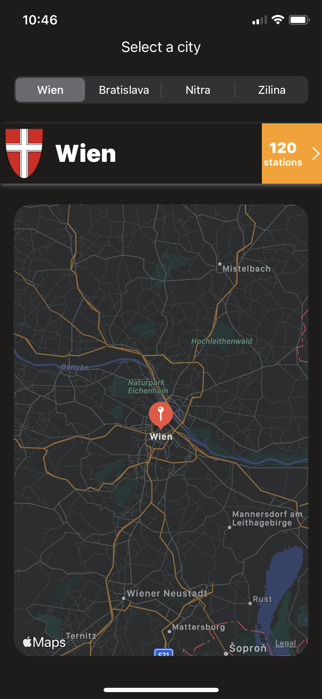
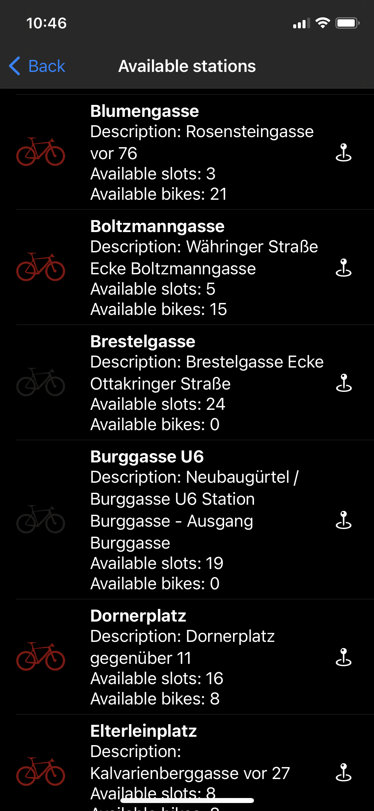
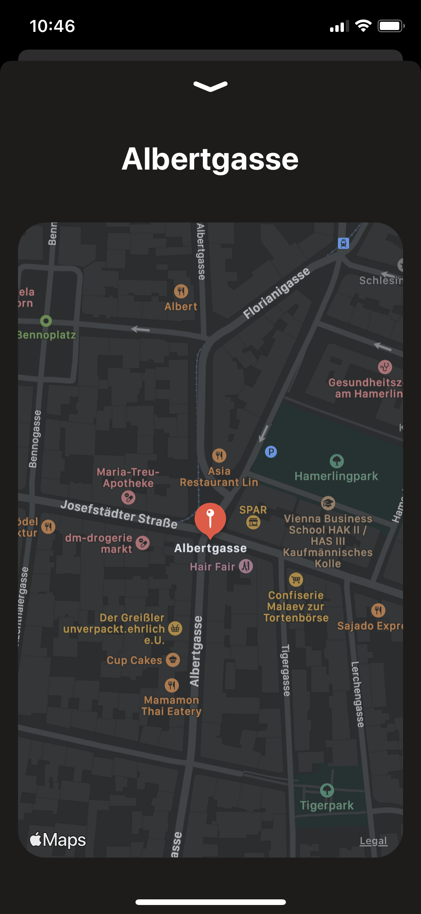

# iOS-BikeShare
iOS app - BikeShare. Created using SwiftUI.

<table>
  <tr>
  <td></td>
  <td></td>
  <td></td>
  </tr>
 </table>

Fetching JSON data from http://api.citybik.es/ to display current status of bike stations around Slovakia. JSON parsing done using Codable/JSONDecoder. Added SwiftUIRefresh library  (https://github.com/siteline/SwiftUIRefresh) with CocoaPods for pull-to-refresh JSON fetch to display the latest data (though API's updated roughly every 10 minutes).

-- 04. march 2017: 2nd commit
Refactored code. Added error handling and small tweaks. Stations in list are now ordered by location (nearest first). In case no location has been acquired, default order by name is used.
